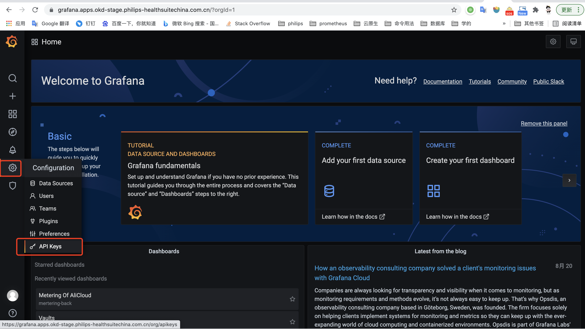
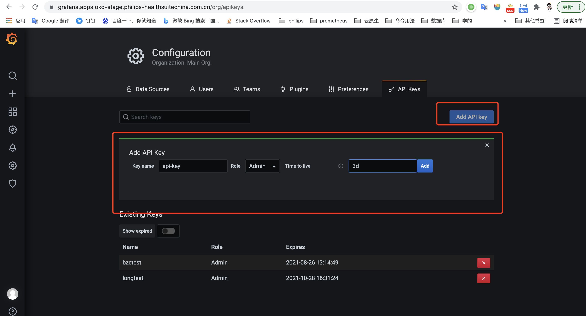
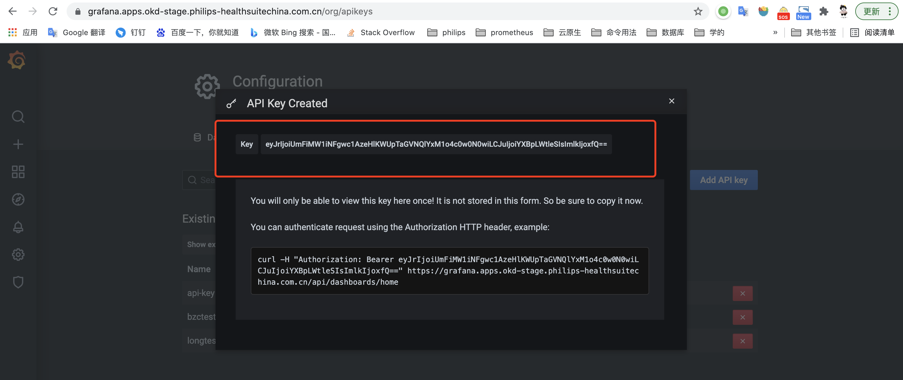
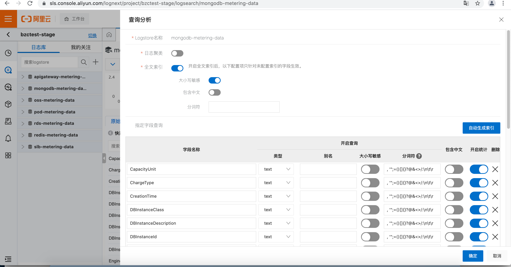
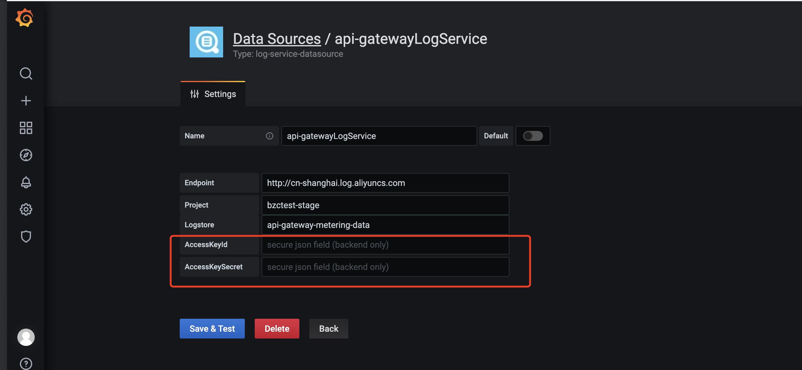

## Prepare

#### Install the required components

| name | Install Document | version |
|---|---|---|
| `terraform` |https://learn.hashicorp.com/tutorials/terraform/install-cli | ~> v1.0.2 |
| `oc` |https://docs.okd.io/latest/cli_reference/openshift_cli/getting-started-cli.html#cli-installing-cli_cli-developer-commands | ~> 4.2 |
| `kubectl` |https://kubernetes.io/docs/tasks/tools | ~> v1.16|
| `aliyun` |https://help.aliyun.com/document_detail/110244.html | ~> 3.0.85|


#### Prepare OKD  Login  token

example:

```
oc login --token=sha256~EC.......U --server=https://api.*******:6443
```

#### Prepare alicloud access_key & access_key

```txt
This user needs to have the following permissions

AliyunRAMFullAccess
AliyunOSSFullAccess
AliyunLogFullAccess
```

#### Prepare Grafana connection information

1. grafana login url
2. get grafana api-key

###### get grafana api-key





#### Prepare Kubernetes Cluster connection information
```
kubeconfig.clusters[0].cluster.server
kubeconfig.users[0].user.client-key-data
kubeconfig.users[0].user.client-certificate-data
```


#### Prepare terraform.tfvars  to current directory

###### terraform.tfvars example

```
VAULT_TOKEN = "s.cjhhjehdwhdjHJH"
k8s_cert    = "LS0.......S0K"
k8s_key     = "LS0.......1CR"
k8s_host    = "https://127.0.0.1:6443"

grafana_auth = "ey......OjF9"
grafana_url  = "https://grafana.dashboard.com.cn" // grafana_url cannot have / at the end

okd_path           = "test-okd_auth" // default okd_auth
kv_path            = "test-kv"       // default kv
okd_NAMESPACE      = "test-metering"     // default metering
okd_role_namespace = ["test-metering"]   // default metering
region             = "cn-shanghai"       //default cn-shanghai
project_name       = "test"              //default test-project-name
```

###### terraform.tfvars Configuration

| Parameter | Description | Default| is_Required|
|---|---|---|--- |
| `VAULT_TOKEN ` | vault login toke  | `null`   | True |
| `k8s_cert ` | kubeconfig.users[0].user.client-certificate-data  | `null`   | True |
| `k8s_key  ` |  kubeconfig.users[0].user.client-key-data | `null`   | True |
| `k8s_host` | kubeconfig.clusters[0].cluster.server  | `null`   | True |
| `grafana_url ` |  grafana login url  | `null`   | True |
| ` grafana_auth` |  grafana api-key | `null`   | True |
| `project_name` | alicloud create log_project name is `${project_name}-${env}` | `test-project-name`   | false |
| ` env` |  deploy environment | `stage`  | False |
| `VAULT_ADDR ` |  vault access url |`http://127.0.0.1:8200`   | False |
| ` kv_path` |  vault_mount kv engine path |`kv`   | False |
| `kv_type ` |  vault_mount kv engine type: {kv,kv_v2} |`kv`   | False |
| `alicloud_secret_path` |alicloud secret name|`ali_alicloud_credential` | False |
| `k8s_secret_path` |k8s secret name |`ali_k8s_credential` | False  |
| `policy_name` |vault policy name|`metering` | False  |
| `alicloud_secret_capabilities` | alicloud_secret_capabilities in policy|`"[\"read\"]"`  |False   |
| `k8s_secret_capabilities` |k8s_secret_capabilities in policy|`"[\"read\"]"`  |False   |
| `okd_path` |vault  backend path|`okd_auth` | False  |
| `okd_role` |vault  backend role|`metering` | False  |
| `okd_role_policy` |vault  backend role bind policy equal  `policy_name`|`metering` | False  |
| `okd_role_namespace` |vault  backend role bind namespaces  equal  `okd_ NAMESPACE` |`metering` | False  |
| `okd_NAMESPACE` |install metering NAMESPACE in OKD cluster|`metering` | False  |
| `region` | alicloud create log_project region| `cn-shanghai`| False  |


#### Prepare backend.tf to current directory


```
terraform {
  backend "oss" {
    bucket = "terraform-backend"  // backend oss name 
    prefix = "metering"   // backend oss dir 
    region = "cn-shanghai" // backend oss region
  }
}

```

## dir tree example

```
.
├── README.md
├── alicloud
│   ├── logservice.tf
│   ├── oss.tf
│   ├── ram.tf
│   └── variable.tf
├── backend.tf
├── grafana
│   ├── Metering-of-Alicloud-Dashboard.json
│   ├── create-grafana-datasource.sh
│   ├── main.tf
│   ├── provider.tf
│   └── variable.tf
├── main.tf
├── okd
│   ├── configmap-hcl-template
│   │   ├── go-config-init.hcl
│   │   ├── go-config.hcl
│   │   ├── python-config-init.hcl
│   │   ├── python-config.hcl
│   │   ├── report-config-init.hcl
│   │   └── report-config.hcl
│   ├── data.tf
│   ├── resource-kubernetes.tf
│   ├── resource-template.tf
│   └── variables.tf
├── provider.tf
├── terraform.tfvars
├── variables.tf
├── vault
│   ├── data.tf
│   ├── resource.tf
│   └── variables.tf
└── versions.tf
```

## create alicloud-logproject && apigateway logstore

project-name: `"${project_name}-${env}"`


logstore
  - name: `apigateway-metering-data`
  - enable-index: `true`
  - import-apigateway-data: `true`
  - Log storage data must be permanent storage

note:  `apigateway-metering-data: This logstore is not only used for metering, so don’t delete it after destroying metering`

## Install

```bash
# login okd cluser
oc login --token=sha256~EC.......U --server=https://api.*******:6443

# port-forward vault to 127.0.0.1:8200
kubectl -n vault  port-forward  vault-0 8200:8200 &

# export alicloud aksk
export ALICLOUD_ACCESS_KEY=......
export ALICLOUD_SECRET_KEY=......

### terraform init in MACOS
unzip providers-linux.zip
terraform init  -plugin-dir providers-macos 

### terraform init in Linux
unzip providers-linux.zip
terraform init  -plugin-dir providers-linux


# try-run
terraform plan  --var-file terraform.tfvars

# install
terraform apply -auto-approve  --var-file terraform.tfvars
```

#### create index for alicloud-oss-logstore




#### add  ACCESS_KEY and SECRET_KEY to grafana datesource

`The contents of the aksk.txt file in the current directory are "ACCESS_KEY" "SECRET_KEY"`





## create resource list
#### alicloud

1. alicloud_log_store: example: `["oss", "pod", "slb", "rds", "mongodb", "redis"]`
2. index create for each alicloud_log_store
3. alicloud.alicloud_ram_policy: `terraform-metering`
4. alicloud.alicloud_oss_bucket: `metering-report-${env}`
5. alicloud.alicloud_ram_user: `metering`
6. alicloud.cmsapi.PutExporterOutput: `oss-metering-report-'${env}`
7. alicloud.cmsapi.PutExporterRule: `["MeteringStorageUtilization-rule", "MeteringGetRequest-rule", "MeteringPutRequest-rule", "InternetSend-rule"]`

list alicloud cmsapi url: https://next.api.aliyun.com/api/Cms/2019-01-01/
#### vault

1. vault_mount: `/test-kv`
2. vault_generic_secret: `/test-kv/ali_alicloud_credential`
3. vault_generic_secret: `/test-kv/ali_k8s_credential`
4. vault_policy: `metering`
5. vault_auth_backend: `test-okd_auth`
6. vault_kubernetes_auth_backend_role: `metering`

#### okd

1. kubernetes_service_account: `metering in test-metering NAMESPACES`
2. kubernetes_cluster_role_binding: `["metering-view-secretspaces","metering-cluster-reader"] in test-metering NAMESPACES`
3. kubernetes_config_map: `metering-report in test-metering NAMESPACES`
4. kubernetes_config_map: `metering-go-data in test-metering NAMESPACES`
5. kubernetes_config_map: `metering-py-data in test-metering NAMESPACES`
6. kubernetes_cron_job: `metering-go-data in test-metering NAMESPACES`
7. kubernetes_cron_job: `metering-py-data in test-metering NAMESPACES`
8. kubernetes_cron_job: `metering-report in test-metering NAMESPACES`

#### grafana

1. grafana_folder: `Metering`
2. grafana_dashboard: `Metering/Metering-of-Alicloud`
3. grafana_datasource : `["ossLogService", "podLogService","rdsLogService","slbLogService","apigatewayLogService","mongodbLogService","redisLogService"`]`


## destroy
note: 

  1. `Delete all files in oss before  destroy operation; but do not delete oss`
  alicloud.alicloud_oss_bucket: `metering-report-${env}`
  
  2. `apigateway-metering-data: This logstore is not only used for metering, so don’t delete it after destroying metering`


```bash

# login okd cluser
oc login --token=sha256~EC.......U --server=https://api.*******:6443

# port-forward vault to 127.0.0.1:8200
kubectl -n vault  port-forward  vault-0 8200:8200 &

# export alicloud aksk
export ALICLOUD_ACCESS_KEY=......
export ALICLOUD_SECRET_KEY=......
# destroy
terraform destroy -auto-approve  --var-file terraform.tfvars
```
